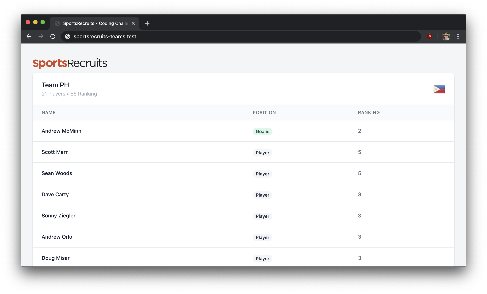

# SportsRecruits Teams

SportsRecruits Teams is a coding excercise I wrote for [SportsRecruits](https://sportsrecruits.com/). The requirements were to take a given list of players and divide them into an even number of teams of 18-22 players, each with a goalie, and each with an approximately equal ranking. Additionally, each generated team needed to be assigned a name and displayed in a Blade view with their players.



## Table of Contents

- [Introduction](#sportsrecruits-teams)

- [Getting started](#getting-started)
  - [Prerequisites](#prerequisites)
  - [Installing](#installing)

- [Testing & Code Quality](#testing-&-code-quality)
  - [PHP CodeSniffer](#php-codesniffer)
  - [PHP Mess Detector](#php-mess-detector)
  - [PHPUnit](#phpunit)

## Getting started

These instructions will get a copy of the project up and running on your local machine for development.

### Prerequisites

You will need PHP 7.2, a database driver (MySQL or SQLite is acceptable), Composer, and Node/NPM. You'll also need a web server; I use [Valet](https://laravel.com/docs/7.x/valet) on macOS.

### Installing

Clone the repository to a folder on your workstation.

```
git clone git@github.com:cbzink/sportsrecruits-teams.git
```

Install Composer dependencies

```
composer install
```

Install NPM dependencies

```
npm install
```

Copy `.env.example` to `.env` and enter the appropriate database credentials.

```
DB_CONNECTION=mysql
DB_HOST=127.0.0.1
DB_PORT=3306
DB_DATABASE=sportsrecruits
DB_USERNAME=root
DB_PASSWORD=
```

Generate an encryption key.

```
php artisan key:generate
```

Build the frontend assets.

```
npm run dev
```

Run the database migrations and seeder. The seeder will import the data provided by SportsRecruits.

```
php artisan migrate && php artisan db:seed
``` 

You're off to the races! Assuming you're using Valet, you should be able to head to http://sportsrecruits-teams.test/ and see the results.

## Testing & Code Quality

### PHP CodeSniffer

PHP CodeSniffer helps you find PSR2 and other coding style violations and fix them. To perform a dry run of PHPCS, run `composer cs`. PHPCS can also automatically fix violations for you by running `composer cs-fix`.

### PHP Mess Detector

PHP Mess Detector analyzes your code for possible bugs, suboptimal code, overcomplicated expressions, and unused parameters, methods, and properties. PHPMD can analyze your code by running `composer phpmd`.

### PHPUnit

This project also has comprehensive unit and feature testing using PHPUnit, with nearly 100% coverage. You can use Artisan's built-in testing functionality; `php artisan test` to run the test suite, or use `composer coverage` to generate a code coverage report.